# CommunityFix.org -- Complete System Blueprint

---

## 1. Vision & Mission

**Vision:** A world where communities can identify, decompose, solve, and track any problem -- from a broken streetlight to systemic inequality -- through structured collective intelligence.

**Mission:** Build an open platform that turns scattered frustration into organized action by giving communities the tools to surface problems, find consensus, design solutions, and hold power accountable.

**Core Insight:** Most civic tech fails at one of three points: (1) problems stay vague and emotional, never becoming actionable, (2) solutions exist but can't find the right people/resources, or (3) outcomes are never tracked, so communities can't learn. CommunityFix closes all three gaps.

---

## 2. Core Loop

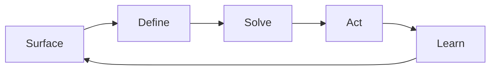

Each stage has clear inputs, outputs, roles, and tools.

---

## 3. System Architecture Overview

### 3.1 Platform Layers

| Layer | Purpose | Technology Direction |
|-------|---------|---------------------|
| **Presentation** | Web app (mobile-first), embeddable widgets | React/Next.js, responsive PWA |
| **Community** | Discussion, deliberation, voting | Discord integration (v1) -> native chat (v2+) |
| **Intelligence** | Clustering, sentiment, similarity | AI/NLP pipeline (embeddings, topic modeling) |
| **Action** | Petitions, letters, volunteer coordination | Integrations, templates, workflows |
| **Data** | Problem graph, solution library, outcomes | PostgreSQL + graph layer (Neo4j or pg graph extensions) |
| **API** | Public REST/GraphQL API | API-first design, everything the UI does is available via API |

### 3.2 High-Level Architecture Diagram

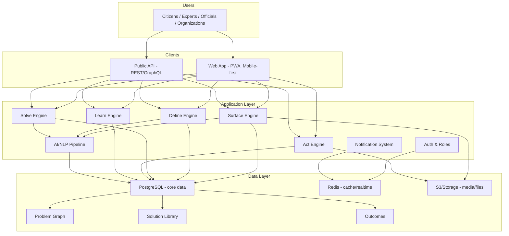

---

## 4. Data Model

### 4.1 Core Entities

#### Problem
```
Problem {
  id: UUID
  title: string
  description: text (structured markdown)
  scale: enum [neighborhood, city, region, national, global]
  status: enum [surfaced, defining, solving, acting, learning, resolved, stale]
  location: geography (optional -- point, area, or "everywhere")
  tags: string[]
  parent_problem_id: UUID? (for sub-issues)
  cluster_id: UUID? (AI-assigned group of similar problems)
  health_score: float (0-1, computed: how well-defined, how much consensus, how actionable)
  submitted_by: User
  created_at, updated_at: timestamp
}
```

#### Sub-Issue
```
SubIssue {
  id: UUID
  problem_id: UUID (FK -> Problem)
  title: string
  description: text
  order: int
  status: enum [open, in_progress, resolved]
  assigned_solution_id: UUID? (FK -> Solution)
}
```

#### Solution (Proposal)
```
Solution {
  id: UUID
  problem_id: UUID (FK -> Problem)
  sub_issue_id: UUID? (FK -> SubIssue, optional)
  title: string
  description: text
  who_acts: string (who needs to do this)
  estimated_cost: string (free text or structured)
  estimated_timeline: string
  precedents: text (has this been done elsewhere?)
  status: enum [draft, proposed, voting, accepted, rejected, in_progress, completed, failed]
  proposed_by: User
  forked_from: UUID? (FK -> Solution, for adapted proposals)
  vote_score: int (computed from votes)
  created_at, updated_at: timestamp
}
```

#### Vote
```
Vote {
  id: UUID
  target_type: enum [problem_priority, solution]
  target_id: UUID
  user_id: UUID
  value: int (quadratic voting: spend voice credits)
  created_at: timestamp
}
```

#### Discussion
```
Discussion {
  id: UUID
  problem_id: UUID (FK -> Problem)
  platform: enum [discord, native]
  external_channel_id: string? (Discord channel ID)
  phase: enum [open, proposing, voting, closed]
  created_at: timestamp
}
```

#### Message (for native chat, v2+)
```
Message {
  id: UUID
  discussion_id: UUID
  author_id: UUID
  content: text
  type: enum [comment, proposal_draft, status_update, observation]
  parent_message_id: UUID? (threading)
  reactions: jsonb
  created_at: timestamp
}
```

#### Action
```
Action {
  id: UUID
  solution_id: UUID (FK -> Solution)
  type: enum [letter_to_official, petition, volunteer_task, funding_request, other]
  status: enum [pending, in_progress, completed, failed]
  assigned_to: User[]
  due_date: date?
  progress_log: ActionUpdate[]
  created_at, updated_at: timestamp
}
```

#### ActionUpdate
```
ActionUpdate {
  id: UUID
  action_id: UUID
  author_id: UUID
  content: text
  attachments: string[] (URLs)
  created_at: timestamp
}
```

#### Observation (Learn phase)
```
Observation {
  id: UUID
  problem_id: UUID
  solution_id: UUID?
  author_id: UUID
  content: text
  outcome_type: enum [success, partial, failure, unexpected, ongoing]
  metrics: jsonb? (quantified results if available)
  created_at: timestamp
}
```

#### User
```
User {
  id: UUID
  display_name: string
  email: string (private)
  avatar_url: string?
  location: geography?
  expertise_tags: string[]
  trust_score: float (contribution-based, not popularity)
  role: enum [citizen, expert, official, moderator, admin]
  voice_credits: int (for quadratic voting, replenished periodically)
  created_at: timestamp
}
```

#### Community
```
Community {
  id: UUID
  name: string
  description: text
  location: geography?
  scale: enum [neighborhood, city, region, national, global, thematic]
  member_count: int
  settings: jsonb
  created_at: timestamp
}
```

### 4.2 Relationships (Graph)

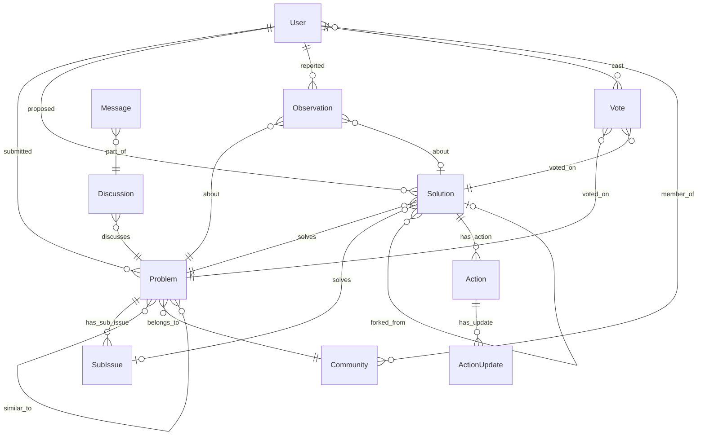

---

## 5. Phase-by-Phase Feature Design

### 5.1 SURFACE -- Problem Submission & Discovery

**Goal:** Make it effortless to report a problem and ensure duplicates cluster together.

**Features:**
- Guided submission form: "What's the problem?" -> "Who is affected?" -> "Where?" -> "What scale?" -> optional photo/evidence upload
- AI-powered duplicate detection: before submitting, show "Similar problems already reported" with option to join existing or create new
- Problem feed: filterable by location, scale, tags, status, recency, trending
- Map view: geographic problems plotted on a map with density heatmaps
- "Me too" button: low-friction way to signal you're affected without submitting a duplicate
- Anonymous submission option (for sensitive issues, especially in smaller communities)

**AI/NLP:**
- Embedding-based similarity search on submission
- Auto-tagging from problem description
- Cluster formation: group similar problems into meta-issues when threshold is reached

### 5.2 DEFINE -- Problem Decomposition

**Goal:** Transform vague complaints into structured, actionable problem statements.

**Features:**
- Problem decomposition wizard: guided breakdown into sub-issues
- Collaborative editing: wiki-style refinement of problem description
- Stakeholder mapping: who is affected, who has power, who has resources
- Root cause analysis tools: guided "5 Whys" or fishbone template
- Evidence board: attach data, articles, reports, photos
- Problem health score: auto-computed from completeness (has root cause analysis? has sub-issues? has stakeholder map? has evidence?)

**Polis-Style Consensus Mapping:**
- Statement submission: anyone can add a statement about the problem
- Binary voting on each statement (agree / disagree / pass)
- AI clusters voters into opinion groups
- Dashboard shows: where groups agree (consensus), where they diverge, and what bridging statements exist
- This replaces unstructured debate with structured opinion mapping

### 5.3 SOLVE -- Discussion & Proposal Design

**Goal:** Move from understanding the problem to proposing concrete solutions.

**Discord Integration (v1):**
- Auto-create a Discord channel per problem when it enters "solving" phase
- Bot posts problem summary, sub-issues, and consensus map as channel header
- Discussion happens naturally in Discord
- Bot commands: `/propose` starts a structured proposal, `/vote` triggers voting phase
- Bot syncs proposals and votes back to CommunityFix.org

**Native Discussion (v2+):**
- Threaded discussions per problem
- Proposal drafting mode: structured form (who acts, cost, timeline, precedents)
- Solution comparison view: side-by-side proposals
- Expert call-out: tag domain experts for review

**Voting Mechanism:**
- Quadratic voting: each user gets N voice credits per period. Voting costs credits^2 (1 vote = 1 credit, 2 votes = 4 credits, 3 votes = 9 credits). Prevents single-issue domination.
- Voting phases: nomination -> deliberation -> final vote
- Results dashboard with breakdown by opinion cluster (from Polis data)

**Solution Forking:**
- "Fork this proposal" -- copy and adapt for different context
- Fork tree visible so you can see lineage of ideas
- Cross-community solution sharing: "City X did this, adapt for your community"

### 5.4 ACT -- Implementation & Accountability

**Goal:** Connect accepted solutions to real-world action.

**Features:**
- Action plan generator: from accepted solution, create task list with owners and deadlines
- Letter/email generator: auto-draft communications to relevant officials using problem data
- Petition creation: integrated petition with signature collection
- Volunteer coordination: sign up for tasks, track hours
- Funding matchmaking: connect problems to relevant grants, budgets, or crowdfunding
- Official response tracker: tag government accounts, track whether they've responded
- Public accountability dashboard: "Problem X was accepted 90 days ago. Status: no official response."
- Progress log: regular updates from people working on the solution

**Integrations:**
- Government open data APIs (where available)
- 311 / municipal reporting systems
- Change.org / petition platforms
- GoFundMe / crowdfunding APIs
- Calendar integration for volunteer events

### 5.5 LEARN -- Outcomes & Knowledge

**Goal:** Close the loop. Did it work? What can we learn?

**Features:**
- Observation submissions: anyone can report what happened after a solution was implemented
- Outcome classification: success / partial / failure / unexpected / ongoing
- Metrics tracking: before/after data where available
- Problem resolution: mark as resolved with evidence, or reopen with explanation
- Community knowledge base: searchable archive of problems, solutions, and outcomes
- Pattern detection: AI identifies recurring problem types and what solutions tend to work
- "What worked" library: curated solutions with outcome data, searchable by problem type
- Annual community report: auto-generated summary of problems surfaced, solved, and impact

---

## 6. Page Structure & User Flows

### 6.1 Sitemap

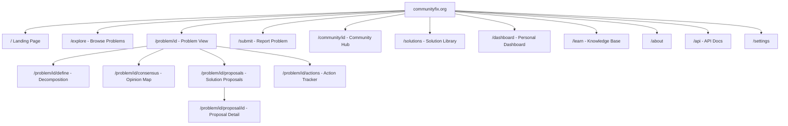

### 6.2 Key User Flows

**Flow 1: Report a Problem**

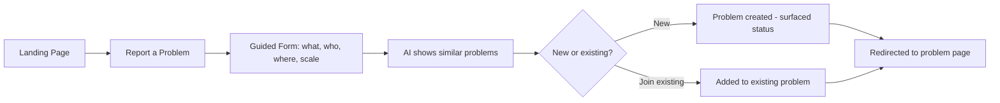

**Flow 2: Define & Decompose**

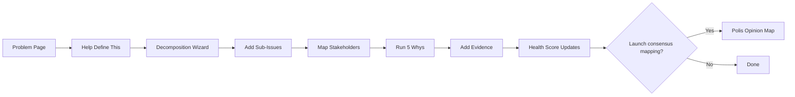

**Flow 3: Propose a Solution**

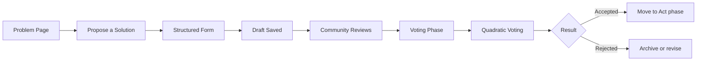

**Flow 4: Take Action**

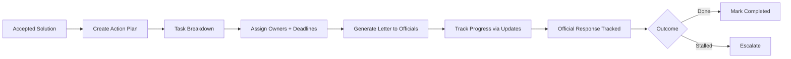

**Flow 5: Report Outcome**

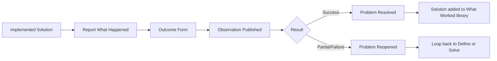

---

## 7. AI & Intelligence Layer

| Capability | Purpose | Approach |
|-----------|---------|----------|
| Duplicate detection | Cluster similar problems at submission time | Text embeddings + cosine similarity |
| Auto-tagging | Categorize problems automatically | Classification model on problem text |
| Consensus mapping | Find opinion clusters and bridging statements | Polis-style dimensionality reduction on vote matrix |
| Problem health scoring | Measure how actionable a problem is | Rule-based scoring on completeness fields |
| Solution matching | Suggest solutions from other communities | Embedding similarity on problem->solution pairs |
| Pattern detection | Identify recurring problem types | Topic modeling over problem corpus |
| Summarization | Summarize long discussions into key points | LLM summarization of discussion threads |
| Sentiment monitoring | Detect when discussions become toxic | Sentiment/toxicity classifier |
| Rising issue detection | Surface emerging problems before they trend | Time-series anomaly detection on submission rate |

---

## 8. Trust, Reputation & Governance

### 8.1 Trust Score

Contribution-based, NOT popularity-based:
- Points for: submitting well-defined problems, proposing solutions, voting, reporting outcomes, moderating
- Decay over inactivity (encourages ongoing participation)
- No public leaderboard (prevents gaming)
- Unlocks: higher vote weight, moderation abilities, expert tagging

### 8.2 Moderation

- Community jury: randomly selected active members review flagged content (like jury duty)
- Rotating moderators: prevents power concentration
- Transparent moderation log: all actions visible
- Appeal process: escalate to broader community vote

### 8.3 Platform Governance

- Sociocratic model: nested circles (neighborhood -> city -> platform-wide)
- Consent-based decisions: proposals pass unless there are "paramount objections"
- Transparency: all governance decisions logged and public
- Revenue/funding decisions made by elected community council

---

## 9. Multi-Scale Design

Problems exist at different scales. The platform handles this via nested communities:

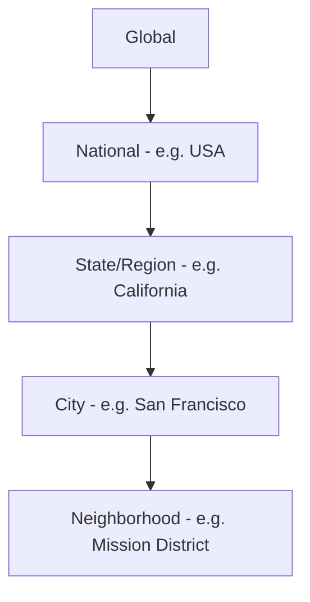

- Problems can be tagged at any scale
- Users can follow multiple communities
- Solutions can "bubble up" (local fix becomes regional policy proposal) or "cascade down" (national policy applied locally)
- Cross-community search: "Show me how other cities solved [X]"

---

## 10. Tech Stack Recommendation

| Component | Technology | Rationale |
|-----------|-----------|-----------|
| Frontend | Next.js + React | SSR for SEO, great DX, mobile-friendly |
| Styling | Tailwind CSS | Rapid iteration, consistent design |
| Backend | Node.js (API routes) or separate FastAPI | Depends on your preference |
| Database | PostgreSQL + PostGIS | Relational + geographic queries |
| Graph queries | pg_graphql or Hasura | Graph relationships without separate DB (v1) |
| Cache | Redis | Real-time features, session management |
| Search | Meilisearch or Typesense | Fast full-text search, faceted filtering |
| AI/ML | Python microservice | Embeddings, clustering, NLP |
| Embeddings | OpenAI or open-source (e5, BGE) | Similarity search |
| Consensus engine | Custom (Polis algorithm is open source) | Fork and adapt Polis |
| Real-time | WebSockets (Socket.io) or SSE | Live voting results, discussion updates |
| Auth | NextAuth.js or Clerk | Social login + email |
| Storage | S3-compatible (Cloudflare R2) | Media uploads, evidence files |
| Hosting | Vercel (frontend) + Railway/Fly.io (API) | Easy deployment, scalable |
| Discord bot | discord.js | Channel management, proposal sync |
| Monitoring | PostHog or Plausible | Privacy-respecting analytics |

---

## 11. Rollout Phases

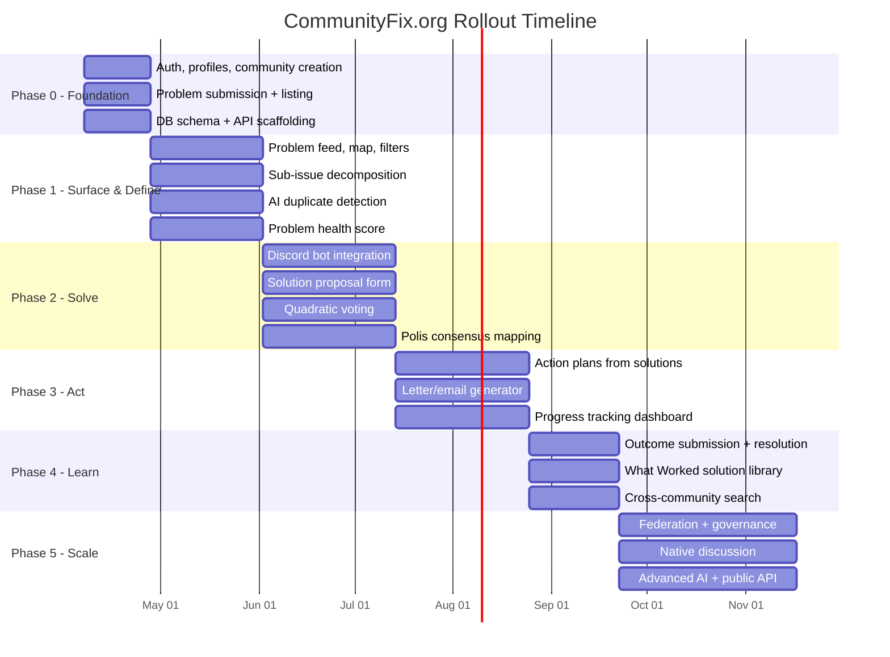

### Phase 0 -- Foundation (Weeks 1-3)
- Auth, user profiles, community creation
- Problem submission form + basic listing
- PostgreSQL schema + API scaffolding

### Phase 1 -- Surface & Define (Weeks 4-8)
- Problem feed with filters, map view
- Sub-issue decomposition
- AI duplicate detection
- "Me too" signaling
- Problem health score

### Phase 2 -- Solve (Weeks 9-14)
- Discord bot integration (auto-create channels, sync proposals)
- Solution proposal form with structured fields
- Quadratic voting system
- Basic Polis-style consensus mapping

### Phase 3 -- Act (Weeks 15-20)
- Action plan creation from accepted solutions
- Letter/email generator to officials
- Progress tracking dashboard
- Volunteer sign-up

### Phase 4 -- Learn (Weeks 21-24)
- Observation/outcome submission
- Problem resolution flow
- "What worked" solution library
- Cross-community solution search

### Phase 5 -- Scale & Govern (Weeks 25+)
- Federation support (self-hosted instances)
- Community governance tools
- Native discussion (replace Discord dependency)
- Advanced AI: pattern detection, rising issues, auto-summarization
- Public API + developer ecosystem
- Mobile app (React Native or PWA enhancement)

---

## 12. Key Metrics to Track

| Metric | What It Measures |
|--------|-----------------|
| Problems surfaced per week | Community engagement |
| % problems reaching "defining" stage | Quality of submissions |
| % problems with accepted solutions | Platform effectiveness |
| Median time: surfaced -> solution accepted | Speed of collective problem-solving |
| % solutions with action plans | Action conversion rate |
| % actions completed | Follow-through rate |
| % problems with outcome observations | Learning loop closure |
| Cross-community solution adoptions | Knowledge sharing |
| User retention (30/60/90 day) | Stickiness |
| Trust score distribution | Health of contribution ecosystem |

---

## 13. Risks & Mitigations

| Risk | Mitigation |
|------|-----------|
| Cold start (no users, no problems) | Seed with real local issues; partner with 1-2 community orgs for pilot |
| Toxic discourse | Polis-style structured voting > open debate; community juries; no reply threads in voting phase |
| Elite capture (power users dominate) | Quadratic voting; rotating moderators; random jury selection |
| "Just venting" without action | Problem health score nudges toward actionability; phase gates |
| Official non-response | Public accountability dashboard; escalation to media/broader community |
| AI bias in clustering | Human review of clusters; transparent algorithm; override option |
| Platform sustainability | Open source core; SaaS layer for hosted communities; grants for civic tech |

---

## 14. Open Questions for You

1. **Pilot community:** Do you have a specific community in mind to launch with? Starting with one real community is 10x more valuable than launching empty.
2. **Discord vs. native chat:** Are you committed to Discord for v1, or would you prefer building lightweight native chat from the start?
3. **Identity:** Anonymous-first or verified-identity-first? This deeply shapes trust dynamics.
4. **Revenue model:** Pure open-source/grant-funded? Freemium SaaS? Government contracts?
5. **Polis integration:** Build your own consensus engine or fork the open-source Polis codebase?
6. **Mobile:** PWA (progressive web app) vs. native mobile app?
